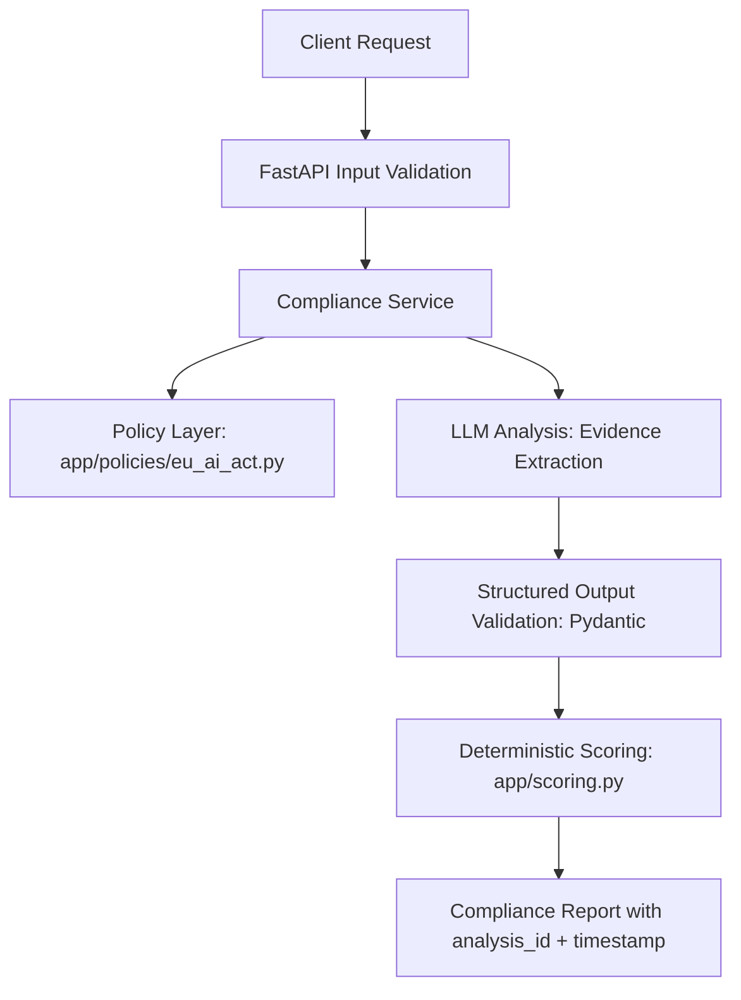

# AI Policy Compliance Checker (EU AI Act)

I built this project because I was tired of manually cross-referencing system requirements with the EU AI Act text while working on AI integrations. I wanted a fast, automated system to audit AI outputs or design descriptions against core regulatory principles (like human oversight, transparency, and data privacy) without flipping through PDF drafts every time.

This repository runs a FastAPI service that evaluates AI descriptions against the EU AI Act. It uses OpenAI (via LangChain structured extraction) to identify violations, find exact text evidence, and suggest fixes, while using deterministic Python rules to score compliance and calculate the final outcome.

---

## 🏗️ Architecture

The flow of requests through the system is structured as follows:



---

## 🛠️ Tech Stack

- **Language:** Python 3.11+
- **API Framework:** FastAPI
- **LLM Orchestration:** LangChain (`langchain-openai`)
- **AI Model:** OpenAI (`gpt-4o-mini` by default, configurable)
- **Containerization:** Docker & Docker Compose
- **Deployment:** GCP Cloud Run ready

---

## ⚖️ Deterministic Scoring & Logic

Unlike simple AI wrappers, this project separates **AI analysis** from **compliance decision-making**:
1. **Evidence Extraction (LLM):** The LLM acts as an auditor. It scans the provided text to locate and quote evidence of violations, suggest recommendations, and flag if there is insufficient information.
2. **Deterministic Evaluation (Python):** The application processes the LLM output in `app/scoring.py` using rigid rules:
   - **Compliant:** No high or medium severity violations found.
   - **Non-Compliant:** One or more high or medium severity violations found.
   - **Insufficient Information:** No high/medium violations found, but the text lacks enough details to confirm compliance.
   - **Score Penalties:** Start at 100 points. High severity violations deduct 50 points; medium violations deduct 20 points; low violations deduct 5 points. The final score is clamped between 0 and 100.

---

## ⚙️ Environment Variables

Create a `.env` file in the root directory (or copy `.env.example`):

```bash
cp .env.example .env
```

Set the following variables inside `.env`:

| Variable | Required | Default | Description |
|---|---|---|---|
| `OPENAI_API_KEY` | **Yes** | None | Your OpenAI API key |
| `OPENAI_MODEL` | No | `gpt-4o-mini` | OpenAI model to use for audits |
| `ALLOWED_ORIGINS` | No | `*` | Configurable CORS allowed origins (comma-separated) |

---

## 🚀 Running Locally

### 1. Setup virtual environment & dependencies

```bash
# Create and activate virtualenv
python -m venv .venv

# Windows:
.venv\Scripts\activate
# macOS/Linux:
source .venv/bin/activate

# Install requirements
pip install -r requirements.txt
```

### 2. Start the API server

```bash
python main.py
```

The server will start at `http://127.0.0.1:8000`. You can test endpoints via Swagger docs at `http://127.0.0.1:8000/docs`.

---

## 🧪 Testing

The project includes unit tests that mock LLM behavior using `pytest`. Tests run quickly and do not call the live OpenAI API:

```bash
python -m pytest
```

---

## 🐳 Running with Docker

If you prefer to run the service in a container:

```bash
# Build the image
docker build -t ai-compliance-checker .

# Run container (passing your env file)
docker run -p 8000:8000 --env-file .env ai-compliance-checker
```

Verify that it's running by hitting `http://localhost:8000/health`.

---

## 📡 API Endpoints

### 1. `GET /health`
Confirms the service is healthy.

### 2. `GET /principles`
Returns details of the 6 EU AI Act principles stored in `app/policies/eu_ai_act.py`.

### 3. `POST /compliance-check`
Runs a compliance audit on the submitted text.

#### Example Request:
```bash
curl -X POST http://localhost:8000/compliance-check \
  -H "Content-Type: application/json" \
  -d '{
    "content": "Our AI model automatically rejects credit applications for applicants living in specific postal codes without human intervention.",
    "context": "Fintech automated lending system"
  }'
```

#### Example Response:
```json
{
  "compliant": false,
  "score": 30,
  "summary": "The described fintech lending system violates core EU AI Act requirements. Automatic denial without human review breaches Article 14, and using postal code as a decision variable creates serious proxy discrimination risk under Article 10.",
  "violations": [
    {
      "principle": "Human Oversight",
      "severity": "high",
      "article_reference": "Art. 14",
      "description": "Fully automated credit denial without a human review pathway violates human oversight rules for high-risk AI decisions.",
      "evidence": "automatically rejects credit applications... without human intervention",
      "explanation": "Fully automated credit denial without a human review pathway violates human oversight rules for high-risk AI decisions.",
      "recommendation": "Add a mandatory human review step before issuing final loan rejections."
    },
    {
      "principle": "Non-Discrimination",
      "severity": "medium",
      "article_reference": "Art. 10",
      "description": "Postal code is a known proxy for race and income, creating indirect discriminatory impact.",
      "evidence": "applicants living in specific postal codes",
      "explanation": "Postal code is a known proxy for race and income, creating indirect discriminatory impact.",
      "recommendation": "Remove geographic zip/postal code features from decision inputs and run demographic parity tests."
    }
  ],
  "recommendations": [
    {
      "principle": "Human Oversight",
      "action": "Add a mandatory human review step before issuing final loan rejections.",
      "priority": "high"
    },
    {
      "principle": "Non-Discrimination",
      "action": "Remove geographic zip/postal code features from decision inputs and run demographic parity tests.",
      "priority": "medium"
    }
  ],
  "eu_ai_act_articles": [
    "Art. 10",
    "Art. 14"
  ],
  "outcome": "NON_COMPLIANT",
  "analysis_id": "8b9e6dc3-f8a1-432d-90c7-1234567890ab",
  "timestamp": "2026-08-15T13:20:00Z",
  "model_used": "gpt-4o-mini"
}
```

---

## 📌 Known Limitations & Disclaimer

- **Not Legal Counsel:** This tool is built to assist developers in audit tracking and AI risk management. It does not provide legally binding compliance evaluations.
- **Short Texts:** The analysis performs best on system descriptions, prompts, and design specifications. It does not parse full multi-page PDF documents.
- **Data Retention:** The API is entirely stateless and does not store uploaded policy descriptions or system contexts to a database.

---

## 📄 License

MIT - feel free to adapt this tool for your own compliance pipelines!
